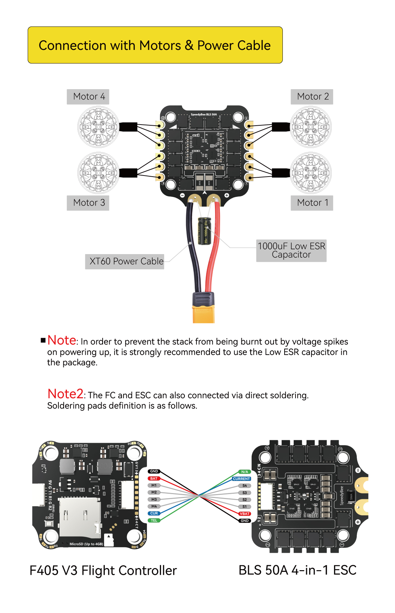

# Debugging DShot: RMT clock, shared ground and ESC arming

**Date:** 2026-07-30
**Authors:** Clement & GPT 5.6 Sol

## Problem summary

The two ESCs produced their normal power-up tones and final initialization
tones, but the motors did not spin when commanded to 5% throttle. Before the
wiring was corrected, connecting or disconnecting wires could briefly move a
motor and could also produce sparks. The two motors also completed
initialization approximately five seconds apart.

There were multiple independent problems:

1. The ESC and ESP32 initially did not have the correct shared signal ground.
2. The DShot library did not fully initialize its RMT configuration, allowing
   the wrong RMT clock source to be selected.
3. The ESCs were initialized sequentially rather than armed together.
4. The library used DShot value 48 during arming instead of explicit
   zero throttle.
5. Several DShot errors were logged or ignored instead of safely stopping motor
   output.

## ESC connector and wiring



### Important colour warning for our cable

Do **not** identify these wires from colour alone.

Our eight-wire cable has the same type of plug on both ends, and we used the
opposite end/orientation from the one implied by the manufacturer diagram. The
apparent colour order is therefore flipped. In our current harness, the
**red conductor on one side is the GND connection**.

The labels in the diagram describe the electrical connector pins, not a
guarantee about the conductor colours as viewed from either end of our cable.
Always identify GND, VBAT, current sense and motor signals using:

1. Connector pin position and orientation.
2. A continuity measurement with all power disconnected.
3. A voltage measurement before connecting the ESP32.

Do not connect VBAT or the current-sense output to an ESP32 GPIO, 3.3 V, 5 V or
GND pin. The 3S battery VBAT connection is approximately 12 V and can damage
the ESP32.

For the propeller stack tested on ESP-IDF 5.5:

| Propeller | ESP32 pin | RMT channel | ESC instance |
| --- | ---: | ---: | --- |
| Bottom | GPIO 4 | 0 | ESC 1 |
| Top | GPIO 25 | 1 | ESC 2 |

ESP-IDF 6 subsequently changed the software interface: RMT channels are now
allocated dynamically, so the GPIO and ESC mappings remain valid but the
application no longer requests channel numbers 0 and 1 explicitly.

## Why a shared ground is required

A digital voltage is always measured relative to a reference.

When the ESP32 produces a nominal 3.3 V DShot signal, it means:

```text
signal voltage = ESP32 GPIO voltage - ESP32 ground voltage
```

The ESC interprets the signal relative to its own ground. If the ESP32 ground
and ESC ground are not connected, the ESC has no reliable reference for
deciding whether the signal is high or low. The apparent signal voltage can
float, become noisy or move outside the expected range.

The correct ESC GND connector pin must therefore be connected to ESP32 GND.
This shared connection is for the signal reference; it does not mean that VBAT
should be connected to the ESP32 power rail.

## What DShot is

DShot is the digital protocol used to send commands from a flight controller
to an electronic speed controller. Each DShot message contains 16 bits:

- 11 bits for throttle or a special command.
- 1 telemetry-request bit.
- 4 checksum bits.

DShot600 transmits 600,000 bits per second, so every bit must last
approximately:

```text
1 / 600,000 = 1.67 microseconds
```

This timing must be accurate. Generating it directly in an ordinary software
loop would be vulnerable to task scheduling, interrupts and other processor
activity.

## What RMT is

RMT means **Remote Control Transceiver**. It is a dedicated ESP32 hardware
peripheral originally intended for precisely timed signals such as infrared
remote controls. It is also useful for DShot, addressable LEDs and other
protocols made from carefully timed high and low pulses.

The software gives RMT instructions such as:

```text
HIGH for 7 clock ticks
LOW for 12 clock ticks
```

RMT then generates those pulses without requiring the CPU to toggle the GPIO at
exactly the right instant.

The DShot library represents each bit using 19 RMT ticks:

- DShot 0: high for 7 ticks and low for 12 ticks.
- DShot 1: high for 14 ticks and low for 5 ticks.

## What APB is

APB means **Advanced Peripheral Bus**. It is an internal part of the ESP32, not
an external wire. It connects and provides a clock to hardware peripherals such
as RMT, UART and timers.

For this ESP32 configuration, the relevant APB clock is 80 MHz. The DShot
library divides it by 7:

```text
80,000,000 / 7 = 11,428,571 RMT ticks per second
```

One RMT tick therefore lasts 87.5 nanoseconds. A 19-tick DShot bit lasts:

```text
19 × 87.5 ns = 1.6625 microseconds
```

That is almost exactly the required 1.67 microseconds for DShot600.

## What went wrong in the code

The original library created its configuration like this:

```cpp
rmt_config_t config;

config.channel = rmtChannel;
config.rmt_mode = RMT_MODE_TX;
config.gpio_num = gpio;
config.mem_block_num = 1;
config.clk_div = 7;
```

In C++, the declaration `rmt_config_t config;` does not automatically clear the
structure. Its memory initially contains whatever data happened to be left in
that stack location.

The library assigned several fields manually but did not assign
`config.flags`. One possible flag tells the legacy RMT driver to use the 1 MHz
reference clock instead of the 80 MHz APB clock. An unpredictable value in
`flags` could therefore accidentally select the reference clock.

With that clock and the existing divide-by-7 setting, the RMT counter would be:

```text
1,000,000 / 7 = 142,857 RMT ticks per second
```

A 19-tick bit would then last:

```text
19 / 142,857 = 133 microseconds
```

That is approximately 80 times slower than DShot600. The ESC could not decode
the waveform as valid DShot.

### Evidence from the startup timing

The original log showed that motor initialization took approximately
12.91 seconds:

```text
I (404) motor_init: Initializing DShot RMT for both motors
I (13314) motor_init: Both ESCs initialized successfully
```

Two sequential five-second arming waits should take only slightly more than
10 seconds. At the incorrect clock, the initial reset packets require
approximately 2.87 additional seconds:

```text
10 seconds + 2.87 seconds ≈ 12.87 seconds
```

This closely matches the observed 12.91 seconds. The pre-fix clock was not
directly measured, so this remains an inference, but the timing evidence and
successful fix strongly support it.

## Code fixes

The RMT configuration is now fully initialized:

```cpp
rmt_config_t config = RMT_DEFAULT_CONFIG_TX(gpio, rmtChannel);
config.clk_div = 7;
config.flags = 0;
```

The software also reads the configured RMT counter clock and refuses to enable
motor output unless it is between 11 MHz and 12 MHz. The expected value is
approximately 11.43 MHz.

The remaining fixes were:

- Use true DShot zero throttle during the arming period.
- Send zero-throttle packets to both ESCs simultaneously for five seconds.
- Stop motor output if RMT installation, arming or throttle transmission fails.
- Preserve the physical mapping of bottom propeller on GPIO 4 and top propeller
  on GPIO 25.

The previous five-second difference between the motors came from calling two
blocking ESC initialization functions sequentially. The first call completed
its five-second wait before the second call began.

### ESP-IDF 6 translation

ESP-IDF 6 removed the legacy `driver/rmt.h` interface used during this
investigation. The migrated implementation therefore does not copy the old
`rmt_config_t`, `clk_div` or `rmt_get_counter_clock()` code. Instead it uses the
new TX driver and requests the counter resolution directly:

```cpp
rmt_tx_channel_config_t config = {};
config.clk_src = RMT_CLK_SRC_DEFAULT;
config.resolution_hz = 11428571;
```

This preserves the tested timing intent: 19 ticks at approximately 11.43 MHz
produces a roughly 1.66 microsecond bit, or about 601.5 kbit/s. The structure is
zero-initialized, so the original uninitialized-flags bug is no longer
applicable. The remaining hardware-tested fixes—true zero throttle,
simultaneous arming, GPIO 4/25 mapping and fail-safe error handling—still apply
and were carried into the IDF 6 implementation.

## Why the startup beeps were misleading

An ESC can use the motor windings as a speaker. Its power-up tones demonstrate
that the battery is powering the ESC, its processor has started and it can
energize the motor phases. They do not, by themselves, prove that the incoming
DShot waveform has the correct bit timing.

## Why the same code could work previously

Uninitialized memory is unpredictable. Depending on compiler version,
ESP-IDF version, optimization settings and previous stack contents,
`config.flags` might happen to contain zero and work correctly. On another
build or run, the same source code can contain a different leftover value and
select the wrong clock.

The code was therefore not reliably correct even when it appeared to work.

## Responsibility

The different problems came from different layers:

- Incorrect ground wire: wiring and system-integration mistake.
- Uninitialized RMT configuration: upstream DShot library bug.
- DShot value 48 during arming: unsafe or questionable library behaviour for
  this ESC.
- Sequential five-second initialization: application integration issue.
- Ignored DShot return values: application integration and safety issue.

The original DShot code was copied into this repository from the
[`Carbon225/esp32-dshot`](https://github.com/Carbon225/esp32-dshot) project.
The upstream source still contains the uninitialized configuration declaration.
The library is also based on the legacy RMT API, which ESP-IDF now marks as
deprecated.

## Should this become an upstream pull request?

Yes. The uninitialized structure is a real upstream defect, the fix is small,
and malformed motor-control timing is safety-relevant.

The first pull request should remain focused and backward-compatible. A minimal
change would be:

```cpp
rmt_config_t config = {};
```

followed by the existing field assignments. This clears every field without
depending on fields that may differ between ESP-IDF versions.

The pull-request description should include:

- The uninitialized `flags` member.
- How it can select the 1 MHz reference clock.
- The expected 11.43 MHz and erroneous 142.86 kHz RMT counter rates.
- The approximately 12.9-second startup timing.
- Confirmation that the motors worked after the configuration was initialized.

Larger changes should preferably be separate follow-ups:

- Use zero throttle during arming.
- Add runtime clock validation.
- Add tests against newer ESP-IDF versions.
- Migrate from deprecated `driver/rmt.h` to `driver/rmt_tx.h`.

## References

- [Espressif RMT documentation](https://documentation.espressif.com/projects/esp-idf/en/v5.4.2/esp32/api-reference/peripherals/rmt.html)
- [Upstream Carbon225/esp32-dshot library](https://github.com/Carbon225/esp32-dshot)
- [Upstream DShotRMT.cpp](https://github.com/Carbon225/esp32-dshot/blob/master/DShotRMT.cpp)
